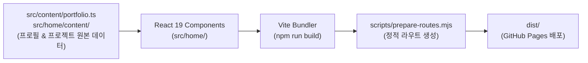

# 🌐 Web Portfolio Application (웹 포트폴리오)

> AI Agent / LLM Application 엔지니어 박태정의 공식 웹 포트폴리오 서비스 소스 코드입니다. React 19와 Vite 기반의 고성능 단일 페이지 애플리케이션(SPA)으로 구성되어 있습니다.

- **🌐 Live URL:** [https://taejung3852.github.io/](https://taejung3852.github.io/)
- **📄 연동 이력서:** `public/documents/taejung-resume.pdf`
- **🛠 기술 스택:** React 19, Vite 8, React Router 7, GSAP, Pretendard

---

## 3분 이해

### 한 문장으로
React 19 및 GSAP 기반의 인터랙티브 SPA로, 핵심 프로젝트 4선과 기술 검증 내역을 직관적으로 전달하는 포트폴리오 웹 애플리케이션입니다.

### 시스템 구조



### 이것만 기억하세요
1. **단일 진실 공급원** (`src/content/portfolio.ts`, `src/home/content/`): 프로필 요약, 연락처, 4대 프로젝트(FOWOCO, HWPX, OwnHands, LLM Gateway)의 텍스트와 링크가 체계적으로 관리됩니다.
2. **라우트 생성 파이프라인** (`scripts/prepare-routes.mjs`): 빌드 시 4대 프로젝트의 상세 정적 라우트(`dist/projects/*`)를 생성하여 GitHub Pages 직접 접근을 보장합니다.
3. **이력서 직결 연동:** 상단 및 프로필 카드 내 '이력서 다운로드' 버튼은 `public/documents/taejung-resume.pdf`를 참조합니다.

---

## 빠른 시작 (Quickstart)

### 사전 요구사항
* Node.js `>= 22.12.0`

### 1. 의존성 설치
```bash
npm install
```

### 2. 로컬 개발 서버 실행
```bash
npm run dev
```
* 브라우저에서 `http://127.0.0.1:5173`에 접속하여 실시간 변경사항을 확인합니다.

### 3. 프로덕션 빌드
```bash
npm run build
```
* `dist/` 디렉토리에 정적 웹 배포 파일이 생성됩니다.

### 4. 배포 미리보기
```bash
npm run preview
```

---

## 디렉토리 구조

```text
portfolio/
├── src/
│   ├── content/
│   │   └── portfolio.ts     # 프로필 및 프로젝트 기본 메타데이터
│   └── home/
│       ├── components/      # React 홈 및 프로젝트 상세 컴포넌트
│       ├── content/         # 컴포넌트별 상세 텍스트 및 데이터
│       ├── styles/          # 모듈형 스타일시트 및 CSS 토큰
│       └── main.jsx         # 라우팅 및 앱 엔트리포인트
├── public/
│   ├── documents/           # 이력서 다운로드 자산 (taejung-resume.pdf)
│   ├── fonts/               # 폰트 에셋 (Pretendard)
│   ├── images/              # 프로젝트 캡처 및 프로필 이미지 에셋
│   └── videos/              # 프로젝트 데모 영상
├── scripts/
│   └── prepare-routes.mjs   # 정적 라우트 자동 생성 스크립트
├── vite.config.js           # Vite 빌드 설정
└── package.json             # 프로젝트 의존성 및 스크립트
```

