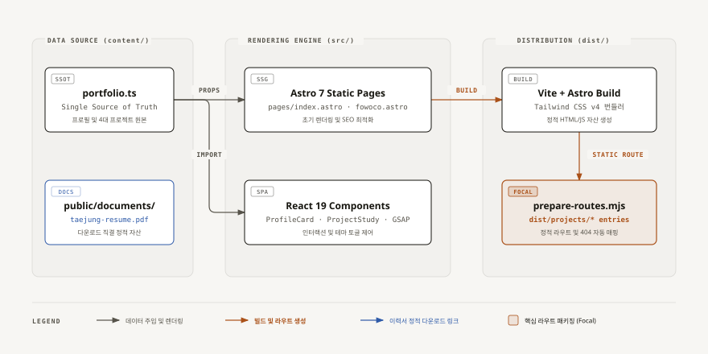
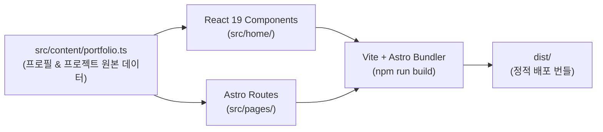

# 🌐 Web Portfolio Application (웹 포트폴리오)

> AI-Native 소프트웨어 엔지니어 박태정의 공식 웹 포트폴리오 서비스 소스 코드입니다. Astro 7 정적 생성과 React 19 인터랙티브 컴포넌트를 결합하여 고성능 포트폴리오를 제공합니다.

- **🌐 Live URL:** [taejung-portfolio.taejung3852.chatgpt.site](https://taejung-portfolio.taejung3852.chatgpt.site/)
- **📄 연동 이력서:** `public/documents/taejung-resume.pdf`
- **🛠 기술 스택:** Astro 7, React 19, Vite 8, Tailwind CSS v4, GSAP, Pretendard

---

## 3분 이해

### 한 문장으로
Astro의 정적 페이지 빌드(SSG)와 React 19 기반의 단일 페이지 컴포넌트를 통합하여, 핵심 프로젝트 4선과 기술 검증 내역을 인터랙티브하게 전달하는 웹 애플리케이션입니다.

### 시스템 구조



<details>
<summary>텍스트 다이어그램 보기 (Mermaid)</summary>



</details>

### 이것만 기억하세요
1. **단일 진실 공급원** (`src/content/portfolio.ts`): 프로필 요약, 연락처, 4대 프로젝트(FOWOCO, HWPX, OwnHands, LLM Gateway)의 텍스트와 링크가 한곳에서 관리됩니다.
2. **라우트 생성 파이프라인** (`scripts/prepare-routes.mjs`): 빌드 시 4대 프로젝트의 상세 정적 라우트(`dist/projects/*`)를 자동으로 구성합니다.
3. **이력서 직결 연동:** 상단 및 프로필 카드 내 '이력서 다운로드' 버튼은 `public/documents/taejung-resume.pdf`를 참조하며, 루트에서 `npm run export:resume`로 언제든 1초 만에 최신화됩니다.

---

## 빠른 시작 (Quickstart)

### 사전 요구사항
* Node.js `>= 22.12.0`

### 1. 의존성 설치
```bash
npm ci
```

### 2. 로컬 개발 서버 실행
```bash
npm run dev
```
* 브라우저에서 `http://127.0.0.1:5173`에 접속하여 실시간 변경사항을 확인합니다.

### 3. 프로덕션 빌드
```bash
npm run build
```
* `dist/` 디렉토리에 정적 웹 배포 파일이 생성됩니다.

### 4. 배포 미리보기
```bash
npm run preview
```

---

## 디렉토리 구조

```text
portfolio/
├── src/
│   ├── content/
│   │   └── portfolio.ts     # 프로필 및 프로젝트 데이터 원본
│   ├── home/                # React 홈 화면 컴포넌트 & 스타일
│   ├── pages/               # Astro 페이지 및 상세 라우트
│   └── styles/              # 글로벌 테마 및 스타일 토큰
├── public/
│   ├── documents/           # 이력서 다운로드 자산 (taejung-resume.pdf)
│   ├── diagrams/            # 검색 및 아키텍처 다이어그램 에셋
│   └── images/              # 포트폴리오 이미지 에셋
├── scripts/
│   └── prepare-routes.mjs   # 정적 라우트 자동 생성 스크립트
├── astro.config.mjs         # Astro 설정 (Tailwind 통합)
├── vite.config.js           # Vite 빌드 설정
└── package.json             # 웹 포트폴리오 의존성 및 스크립트
```

---

## 연계 문서
* [2페이지 개발자 이력서 관리 가이드 (../resume/README.md)](../resume/README.md)
